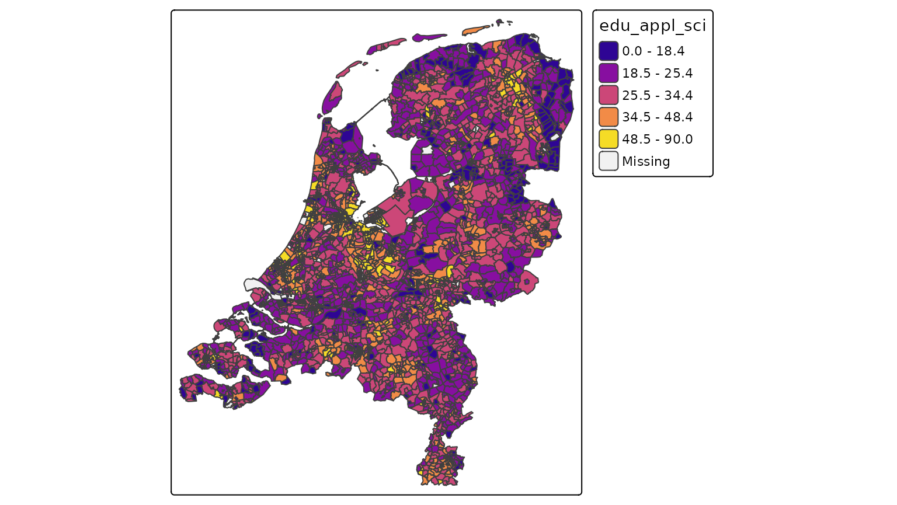

# Introduction

## Introduction

Until version 4.3, it was only possible to visualize spatial data stored
in memory with `tmap`, e.g. objects from the class packages `sf`,
`terra`, or `stars`.

For instance, the dataset `NLD_dist` is an `sf` object. A choropleth is
created as follows:

``` r
library(tmap)
tm_shape(NLD_dist) +
    tm_polygons(
        fill = "edu_appl_sci",
        fill.scale = tm_scale_intervals(style = "kmeans", values = "plasma"))
```



However, what if we have a huge remote data source that we would like to
visualize? With this package, `tmap.sources` it is possible to specify
`tm_shape(url)` with `url` being the url of the remote dataset.

Currently only `PMTiles`, a remote tile-based data sources are
supported, but support for other remote data sources will be added
later. Obvious candidate file types: GeoParquet, FlatGeobuf, and Cloud
Optimised GeoTIFF (COG).

To run `tmap.sources`, besides `tmap`, another package is required,
namely
[`tmap.mapgl`](https://r-tmap.github.io/tmap.mapgl/articles/mapgl),
because we require the tmap mode `"maplibre"`:

``` r
library(tmap.mapgl)
library(tmap.sources)
tmap_mode("maplibre")
#> ℹ tmap modes "plot" -> "view" -> "mapbox" -> "maplibre"
#> ℹ rotate with `tmap::rtm()`switch to "plot" with `tmap::ttm()`
```

## Data processing

Important to realise is that the internal data processing in tmap is
skipped entirely. So getting all the categoires (categorical scale), or
retrieving the range and optimal interval breaks (interval scale) on
basis on the complete data is not possbile, simply because it would take
a lot of computation time (some remote datasets may cover trillions of
objects). Instead, these scales are supported:

- As-is scale `tm_scale_asis`, in which the visual values (e.g. color
  values) are already contained in the data.
- The categorical scale `tm_scale_categorical`, where the data contains
  the levels. The user has to specify the used mapping, so a vector of
  levels and a vector of correspoding visual values (e.g. colors). And
  optionally a vector of corresponding labels (in case they differ from
  levels).
- The continuous scale `tm_scale_continuous` is used to scale the height
  of 3d polygons.

Other scales, in particular numeric scales (both interval and
continuous) will be added later.
